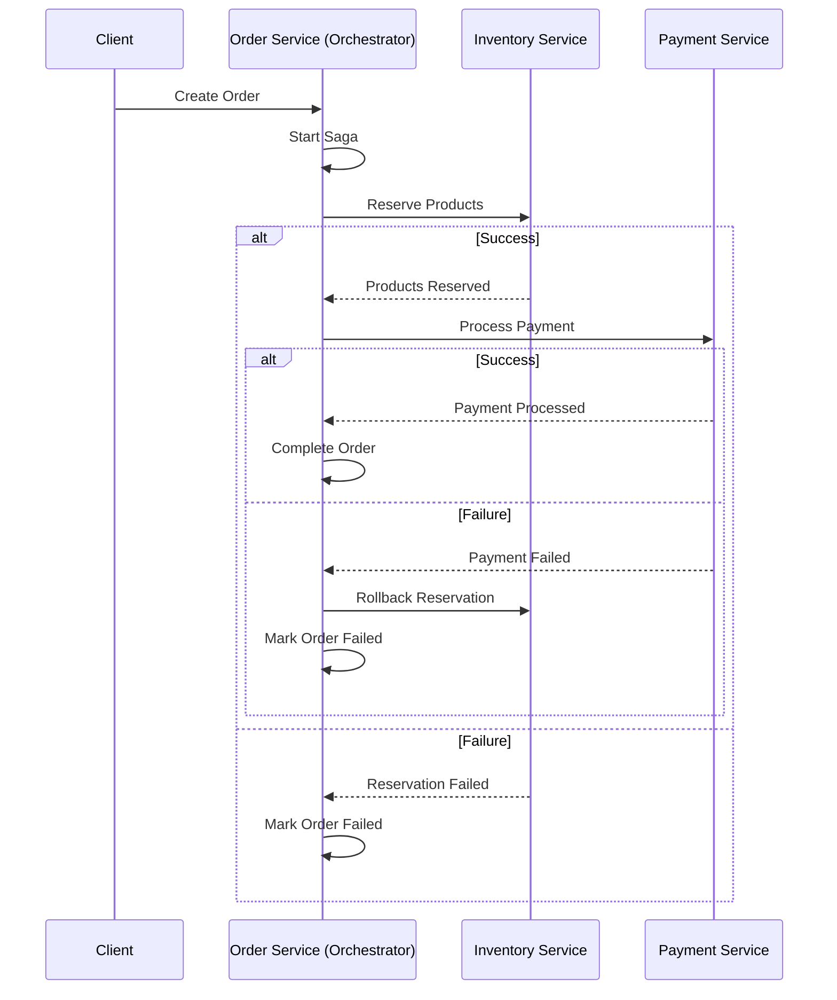

# Saga Pattern Implementation in Go

This is a practical implementation of the Saga pattern in Go, demonstrating how to handle distributed transactions across multiple microservices with actual database integration.

## Architecture

The application consists of three microservices:

1. **Order Service** (Port 9080)
   - Acts as the Saga Orchestrator
   - Handles order creation and management
   - Coordinates the distributed transaction
   - Uses PostgreSQL for order storage

2. **Inventory Service** (Port 9081)
   - Manages product inventory
   - Handles reservation and rollback of products
   - Uses PostgreSQL for inventory storage

3. **Payment Service** (Port 9082)
   - Processes payments
   - Handles payment rollbacks
   - Uses PostgreSQL for payment records

## Saga Pattern Implementation

This project implements an Orchestration-Based Saga pattern, where the Order Service acts as the central orchestrator for the distributed transaction.

### Transaction Flow



### Compensating Transactions

The implementation includes compensating transactions to maintain data consistency:
- If payment fails, the inventory reservation is rolled back
- If any service fails, the order is marked as failed
- Each service maintains its own database and handles its own rollbacks

## Prerequisites

- Docker and Docker Compose
- Go 1.21 or later
- PostgreSQL client (psql)

## Setup and Running

1. Build and start all services:
```bash
docker-compose up --build
```

This will:
- Start all three PostgreSQL databases
- Initialize the databases with the schemas from the migrations directory
- Build and start the Order Service (port 9080)
- Build and start the Payment Service (port 9082)
- Build and start the Inventory Service (port 9081)
- Start Redis (port 6389)

## Service Endpoints

- Order Service: http://localhost:9080
- Inventory Service: http://localhost:9081
- Payment Service: http://localhost:9082

## Database Ports (if needed for direct access)

- Order Service DB: 5433
- Payment Service DB: 5434
- Inventory Service DB: 5435
- Redis: 6389

## Testing the Saga Pattern

Create a new order using curl:

```bash
curl -X POST http://localhost:9080/api/orders \
  -H "Content-Type: application/json" \
  -d '{
    "user_id": "user123",
    "amount": 100.00,
    "products": [
      {
        "id": "prod1",
        "name": "Product 1",
        "price": 50.00,
        "quantity": 1
      },
      {
        "id": "prod2",
        "name": "Product 2",
        "price": 50.00,
        "quantity": 1
      }
    ]
  }'
```

## Implementation Details

The saga pattern is implemented with the following flow:

1. Create Order (Order Service)
2. Reserve Inventory (Inventory Service)
   - If fails, mark order as failed
3. Process Payment (Payment Service)
   - If fails, rollback inventory and mark order as failed
4. Complete Order (Order Service)
   - Mark order as completed

Each service has its own database and handles its own data consistency. The Order Service acts as the saga orchestrator, coordinating the entire process and handling compensating transactions when necessary.

## Choosing the Saga Orchestrator

When implementing a Saga pattern, choosing the right orchestrator is crucial. Here are the key factors to consider:

### 1. Business Transaction Initiator
- Choose the service that initiates the business transaction
- Examples:
  - Order Service for e-commerce transactions
  - Payment Service for subscription management
  - Booking Service for travel reservations
  - Shipping Service for logistics operations

### 2. Data Ownership
- Select the service that owns the primary transaction data
- Should have the final state of the business process
- Examples:
  ```
  Order Flow: Order Service (✓)
  - Owns order status
  - Maintains order history
  - Has final state of order

  Booking Flow: Booking Service (✓)
  - Owns booking details
  - Manages booking status
  - Tracks entire booking lifecycle
  ```

### 3. Transaction Visibility
- Choose the service that needs complete visibility of the transaction
- Must be able to make decisions based on the overall state
- Example:
  ```go
  // Order Service needs to know about both inventory and payment
  func startOrderSaga(order Order) {
      // Knows about inventory status
      inventoryStatus := checkInventory()
      
      // Knows about payment status
      paymentStatus := processPayment()
      
      // Makes final decision
      if inventoryStatus && paymentStatus {
          completeOrder()
      }
  }
  ```

### 4. Compensating Transaction Control
- Select the service best positioned to handle rollbacks
- Should understand the complete transaction flow
- Example:
  ```go
  // Order Service can coordinate rollbacks
  if paymentFails {
      // Knows to rollback inventory first
      rollbackInventory()
      // Then update order status
      updateOrderStatus("failed")
  }
  ```

### 5. Domain Expertise
- Choose based on domain-driven design principles
- Service should be in the core domain
- Examples:
  ```
  E-commerce: Order Service (✓)
  Travel Booking: Booking Service (✓)
  Banking: Account Service (✓)
  ```

### 6. Dependency Direction
- Orchestrator should have minimal downstream dependencies
- Other services shouldn’t depend on the orchestrator
- Example:
  ```
  Good:
  Order Service → Inventory Service
  Order Service → Payment Service
  
  Bad:
  Inventory Service → Order Service
  Payment Service → Order Service
  ```

### 7. Scalability Requirements
- Consider which service needs to scale with transaction volume
- Orchestrator typically needs more resources
- Example:
  ```yaml
  # docker-compose.yml
  order-service:
    deploy:
      replicas: 3  # Orchestrator needs more replicas
  inventory-service:
    deploy:
      replicas: 1
  ```

### Real-World Examples

1. **E-commerce Platform**
```
Orchestrator: Order Service
Why?
- Initiates the purchase flow
- Owns order status
- Needs visibility of inventory and payment
```

2. **Travel Booking System**
```
Orchestrator: Booking Service
Why?
- Starts the booking process
- Manages booking state
- Coordinates hotels, flights, and payments
```

3. **Banking Transaction**
```
Orchestrator: Account Service
Why?
- Initiates fund transfers
- Owns account balances
- Needs transaction atomicity
```

4. **Food Delivery**
```
Orchestrator: Order Service
Why?
- Starts the delivery process
- Tracks order status
- Coordinates restaurant and delivery
```

### Key Takeaways

The choice of orchestrator should align with your business domain and requirements. The orchestrator should be the service that:
1. Makes the most sense from a business perspective
2. Has the most complete view of the transaction
3. Can effectively manage compensating transactions
4. Scales well with your business needs

## Production Considerations

For a production environment, consider implementing the following enhancements:

### 1. Message Queue Integration
- Replace HTTP calls with message queues (RabbitMQ/Kafka)
- Implement asynchronous communication
- Handle message persistence and retry

### 2. Reliability Mechanisms
- Implement retry policies with exponential backoff
- Add circuit breakers for service calls
- Handle timeout scenarios
- Implement idempotency for all operations

### 3. State Management
- Use a state machine for saga orchestration
- Persist saga state for recovery
- Handle partial completion scenarios

### 4. Monitoring and Observability
- Add distributed tracing (e.g., OpenTelemetry)
- Implement comprehensive logging
- Add metrics for monitoring
- Set up alerting for failures

### 5. Security
- Implement service authentication
- Add API authorization
- Secure sensitive data
- Add rate limiting

### 6. Scalability
- Implement service discovery
- Add load balancing
- Handle horizontal scaling
- Manage database connections efficiently

### 7. Testing
- Add unit tests for each service
- Implement integration tests
- Add chaos testing
- Test compensating transactions
- Simulate various failure scenarios

## Benefits of Orchestration-Based Saga

1. **Centralized Control**
   - Clear transaction flow
   - Easier to track state
   - Simplified error handling

2. **Consistency**
   - Guaranteed execution order
   - Proper handling of compensating transactions
   - Maintained data consistency across services

3. **Monitoring**
   - Single point for transaction tracking
   - Easier to implement logging
   - Simplified debugging

4. **Maintenance**
   - Clear separation of concerns
   - Easier to modify transaction flow
   - Simplified service updates


## Types of Saga Patterns

1. Choreography-Based Saga (Event-Driven):
   - No central coordinator
   - Services communicate through events
   - Each service listens for events and performs its actions
   - More decentralized but can be harder to track

2. Orchestration-Based Saga (What we implemented):
   - One service acts as the orchestrator (in our case, the Order Service)
   - The orchestrator:
   - Manages the transaction flow
   - Coordinates with other services
   - Handles compensating transactions (rollbacks)
   - Maintains the state of the entire saga